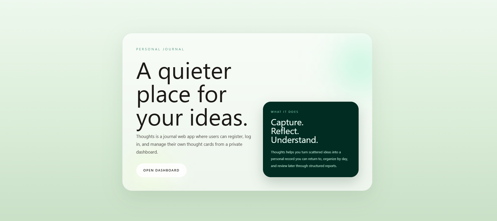
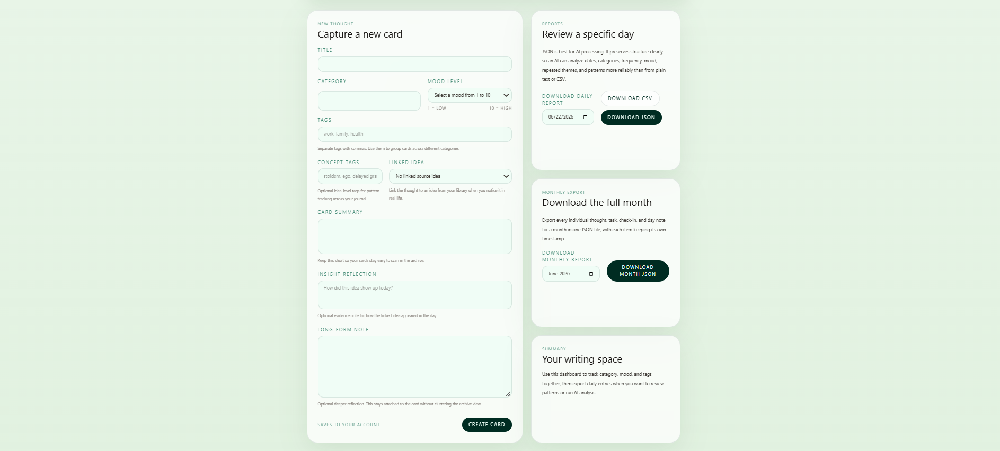
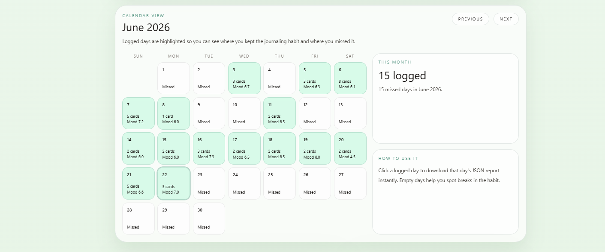
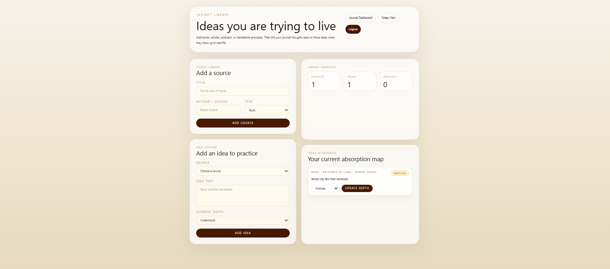

# Thoughts

A private self-management system for structured reflection, daily execution, and personal knowledge tracking.

Thoughts combines journaling, task management, recurring routines, insight tracking, and structured data exports into a single personal workspace. It is designed around one private user account, with each user managing their own thoughts, tasks, reflections, and source ideas inside a secured dashboard.

## Table of Contents

- [Overview](#overview)
- [Screenshots](#screenshots)
- [Features](#features)
- [Tech Stack](#tech-stack)
- [Data Model](#data-model)
- [Getting Started](#getting-started)
- [Export Format](#export-format)

## Overview

Most journaling tools treat entries as unstructured text. Thoughts treats each entry as a structured record with mood scores, categories, tags, concept tags, and optional links to ideas from an insight library. That makes the app useful not only for writing things down, but also for reviewing patterns across days, routines, and ideas.

The system operates across three layers:

- `Capture` - Save thought cards with structured reflection data.
- `Execute` - Run the day through task management, recurring routines, and check-ins.
- `Review` - Export daily and monthly records for analysis, reflection, or AI workflows.

## Screenshots

### Landing Page

<p align="center">
  
</p>

The landing page introduces the app as a calm private workspace for reflection and structured review.

### Journal Dashboard: Capture and Export

<p align="center">
  
</p>

The main dashboard lets users capture structured thought cards and export daily or monthly reports.

### Journal Dashboard: Calendar Review

<p align="center">
  
</p>

The calendar view highlights consistency, missed days, and day-level mood patterns across the month.

### Insight Library

<p align="center">
  
</p>

The insight library connects books, articles, and principles to the ideas the user is actively trying to apply.

## Features

### Journal and Reflection

The journal dashboard is the main reflection surface.

- Create thought cards with a title, category, mood score, summary, long-form note, tags, and concept tags.
- Edit and delete existing thought cards.
- Link a thought to an idea from the insight library.
- Store reflection evidence for how a source idea appeared in real life.
- View a monthly calendar showing logged days and missed days.
- Review archive cards with mood, category, timestamps, and linked idea context.

### Daily Operating System

The `/dashboard/today` page functions as the daily command center.

- View tasks for a selected date.
- Create day-specific tasks with priority, tags, and notes.
- Move tasks through `todo`, `in_progress`, `done`, and `skipped`.
- Save a daily intention and end-of-day reflection note.
- Record an end-of-day mood score.
- Log multiple timestamped check-ins with mood, energy, focus, and short notes.
- Roll unfinished tasks forward to the next day.

### Recurring Task Management

A rule-based recurring task system handles routines without requiring manual re-entry.

- Create recurring task templates with weekday schedules.
- Set start dates and optional end dates for task recurrence.
- Assign priority, tags, and notes to recurring templates.
- Activate or deactivate recurring task rules.
- Auto-generate daily task instances from active templates on matching dates.
- Prevent duplicate recurring task instances for the same template on the same date.

### Completion Tracking

The completion dashboard turns day-to-day task activity into measurable output.

- View daily completion percentages.
- Review completion data across the last 30 days.
- Browse month-level completion breakdowns.
- Track high-completion streaks.
- Compare completed tasks against total scheduled tasks.

### Insight Library

The app includes an idea-to-practice tracking system.

- Add source entries for books, articles, podcasts, and standalone principles.
- Capture specific ideas from each source.
- Track idea progress through `understood`, `noticed`, `applied`, and `internalized`.
- Link journal thoughts back to source ideas when they surface in real life.
- Update idea depth over time as understanding becomes application.

### Structured Reports and Exports

All major data in the app can be exported in structured formats.

- Export daily reports as JSON or CSV.
- Export monthly reports as JSON.
- Daily exports include thought cards, tasks, task progress summaries, day notes, and check-ins.
- Monthly exports include thoughts, tasks, check-ins, day notes, and grouped day-by-day summaries.
- Export payloads preserve timestamps and structured fields for downstream review or AI analysis.

## Tech Stack

- Framework: Next.js App Router
- Language: TypeScript
- UI: React
- Styling: Tailwind CSS
- Database: PostgreSQL via `pg`
- Authentication: Signed cookie-based sessions
- Runtime: Node.js

## Data Model

Thoughts manages these core entities:

- Users
- Thought cards
- Daily tasks
- Recurring task templates
- Day notes
- Daily check-ins
- Source library items
- Source ideas
- Concept tags
- Insight links between thoughts and ideas

## Getting Started

```bash
npm install
npm run dev
```

Open `http://localhost:3000` in the browser.

To run the app correctly, configure the required environment variables for:

- PostgreSQL database access
- `AUTH_SECRET` for signed session cookies

## Export Format

Daily and monthly exports are structured for analysis and archiving. They preserve timestamps, mood scores, task states, check-in data, and related reflection records in machine-readable form.

Example daily export shape:

```json
{
  "date": "2026-06-22",
  "thoughts": [],
  "tasks": [],
  "task_progress": {
    "total": 3,
    "done": 2,
    "completion_rate": 66.7
  },
  "day_note": {
    "intention": "...",
    "note": "..."
  },
  "check_ins": []
}
```

## In One Sentence

Thoughts is a private personal knowledge and productivity system that helps a user capture thoughts, run daily tasks, track recurring routines, connect lived experiences to ideas, and export the full record in a structured format.
